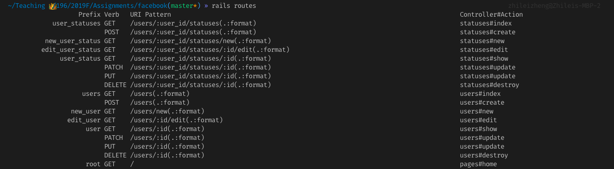

# HW3 - Facebook Lite
Regular credit is due **11:59PM, Wednesday, Nov.14th.**
Extra credit is due **on the last day of class.**

Late day policy: You can use the late days you earned in previous assignments on this homework.
Collaboration Policy: You can collaborate with anyone in any form on any part of the homework, but you must write your own code.

## Overview
In this homework, you will build a simple social network app: 
* Authentication: A user can sign up, log in and log out of your app. 
* Making statuses: When he/she is logged in, he/she can post statuses.
* Twitter-style following: A user can follow other users, and can be followed by other users.
* Home Feed: A user can see the statuses of all the users he/she follows in his/her homepage.

The writeup for this homework is intentionally vague. As long as you have the above four features coherently, your submission is considered good.

But in general, We recommend doing this homework in 3 steps: First tackle the posting of statuses, then add authentication, and finally add follow and home feed features.

## Set Up
Before diving into the models, you should have a homepage set up, along with Bootstrap, and other third party gems.
#### Tasks
1. Install the gems needed for this homework:
    * `pry` gem is a useful tool to debug your controller methods
    * `BCrypt` will be used to hash user's plaintext passwords before storing to database
    * `bootstrap` and `jquery-rails` you already know from hw2, so follow the steps to set them up.
2. Add a `pages_controller.rb` in `./app/controllers` and have a `home` method in it. 
    * Then in `routes.rb`, set the root path to `pages#home`
    * Don't forget the corresponding view template: `views/pages/home.html.erb`
    * This is the same step you did for HW2.
3. Add the provided `_navbar.html` partial to `views/layouts`.
    1. Then add the navbar to `application.html.erb` before `yield`.
    2. Add a `<div...` with class `container` around `yield`.

#### Sanity Check
After finishing the above steps, you should see this when you visit `localhost:3000`:

#### Observation and Notes
In the following sections of different "milestones", you will have to modify the provided `_navbar.html.erb`.
1. "Users" will link to the `index` page of all users, and "Sign Up" will link to the `new` page. Currently, their links are stubbed by "TODO". You will do this after milestone 1.
2. The navbar currently does not make sense. Why would you have both "sign up" and "log out"? Ideally, only users who are logged in can see "Users" and "Log Out", and only users who are not logged in can see "Sign Up" and "Log In". You will fix this after milestone 2, when you have implemented sessions and authentication.

## Milestone 1: Users Posting Statuses
In this part you should create two models:
* A `User` has a `first_name`, a `last_name`, an `email`, and a `password_hash`, all of which are type `string`.
* A `Status` belongs to a `User`, so it has a `reference` column to a `User`, along with a `content` of type `text`.

I recommend using `rails g scaffold ...` to create everything, but you are also welcomed to use `rails g model`+ `rails g controller` for finer-granularity control of what to create. But either way, you will have to change/write a dozen lines of code to make `statuses` **nested resources** of `users`.

#### Tasks
1. Create the two models and corresponding view files as instructed above. 
    * After that, when you run `rails routes`, you should see something like this:

2. Make `statuses` nested resources of `users` in `routes.rb`. After that, when you run `rails routes` in the command line, you should see your routes listed exactly like this:

Notice how there is no `/statuses` or `/statuses/:id`. Statuses only exist in the context of a user. (nested resources)
1. Right now if you boot up `rails s`, your `user` paths should work as usual. But non of the `status` paths work. (If you go to `/users/2/statuses`, you will see an error). Your next task is to make all of them work again!
    * Most of these errors are due to the wrong usage of path prefix helpers. Look at and compare the `prefix` columns of the above two `rails routes` output. You should be able to figure out what paths to use.
    * Many of the errors are also due to the wrong implementation of the `StatusesController` methods. 
        * For example, the `index` method is wrong in that instead of doing `Status.all`, it should do `@user.statuses.all`
        * All the other methods are also off in their own ways, mostly because they fail to do CRUD **only in the context of the user**. Change them as well!
    * You have to change the `views/statuses/_form.html.erb`. Be sure to remove the `user` text input from the view. 
2. Ultimately, you want to have all the features of this [demo here](https://cis196-hw3-demo0.herokuapp.com/users/1/statuses).
**It is important to make sure your implementation works exactly the same as the demo. Otherwise it would be a mess to proceed!**
1. Notice that for our project,  `/users/:user_id/statuses` is actually redundant. We can just use the user's `show` page to display all his/her statuses. We do not need a separate page to do that.
    * Change `routes.rb`, `statuses_controller.rb` and `/views/statuses/` to remove that route
    * Change `/views/users/show.html.erb` to display all the posts of a specific user.
    * You should display all the statuses in a `<ul>`, with each status content as an `<li>`. 
    If the user has no post, display a "This user has no post" string instead of the `<ul>`.
2. Link the "User" link in the navbar to `/users` path, but use prefix helpers.
Also link the "Sign Up" link in the navbar to `/users/new`, but use prefix helpers.

#### Sanity Check
At this point, your project should have **exactly the same** features and functionality of [this demo](https://cis196-hw3-demo1.herokuapp.com/users/1). You can play around with it and try to do CRUD operations on both models.

Visually yours can be different, but you should aim to replicate the demo as much as you can. Also, make sure you are not using any explicit string routes. 

Always use route helpers!

## Milestone 2: Implementing Sessions, Authentications, and Validations
Many part of this project still doesn't make any sense as a Facebook. Right now, any user of this app can delete and make changes to any actual `users` in the database. We want to add authentications. The views and functionality should be different based on whether or not a user is logged in.
#### Tasks
1. Add some validations to the models:
    * For the user's form, the first name, last name, and email fields should not be empty. 
    * The first name, last name should all be capitalized.
    * No two users should have the same email.
    * For the status's form, the content of the form should be more than 10 characters.
2. Follow lectures 8 to enable the authentication feature.

    1. Add helper functions in `application_controller`
    2. Add a `SessionsController` and route requests of "Log In", and "Log Out", etc. to it. Be sure to provide the views (forms for log in, etc.)
3. Be sure to customize the view files based on:
    1. Whether or not the user is authenticated /logged in
    2. Who the user actually is
        * A user can only edit/create/delete new statuses for him/herself after log in, not for other users.
    3. Also check whether or not a user is logged in in the navbar. If yes, then only "User" and "Log Out" are displayed, else only "Sign Up" and "Log In" are displayed
    4. Add a link from `/login` page to `/signup` page, and a link from `signup` page to `login` page.
    5. For the root page, if the user is authenticated, display his/her full name instead of "Home".
4. Add `before_actions`. If a user is not authenticated, most controller methods should redirect the user to the login page.
5. Storing plaintext password is super dangerous! Follow the tutorials in [BCrypt Gem's README](https://github.com/codahale/bcrypt-ruby/) to generate the hash of user input passwords.
    * Change the form of the user to display "password" instead of "password hash" in the input label.
    * Change the sessions controller to make sure authentication still works. 
    * After you are sure that only password hashes are stored, remove the display of `password_hash` from the `/users` and `/users/:user_id` pages.
5. Add a link from `/login` page to `/signup` page, and a link from `/signup` page to `/login` page.

#### Sanity Check
At this point, your project should have **exactly the same** features and functionality of this demo [MISSING LINK]. You can/should play around with it as both a non-authenticated user and an authenticated user.

Visually yours can be different, but you should aim to replicate the demo as much as you can. 

## Milestone 3: Following Users, and Personal Feed

Let's build some social network features! In this section, you will implement a twitter-style following (Facebook style friendship is an extra credit), where a user can follow many other users, and can also have many followers.

Note that this is a little different from the many-to-many association we discussed in class, in that we only have one table instead of two, but the logic of the implementation is the same: through an intermediate table called `Followship`, a user can have many `users` as `followers`.

#### Tasks
1. Create a model with Model generator called `Followership` which has `user` of type `references`, and a `follower` of type `references`.
2. To prevent ActiveRecord from looking for a non-existent table of `follower`, you should remove the `foreign_key: false` from the newly generated migration file, and add: `add_foreign_key :followerships, :users, column: :follower_id` as the last line of `def change` method.
3. Change the `Follwership.rb` and `User.rb` to enable the many-to-many-through association.
    * After that, check in `rails c` to make sure you that given two users: `user1` and `user2`, if you do `user1.followers.create({user: user1, follower: user2})`, then `user1.followers` contains `user2`.
    * If the above functionality works, then the model layer of followership is working.
4. Add two route in routes.rb, then implement the two route methods in the relevant controller:
    1. `post "/users/:user_id/follow"` points to `users#follow`
    2. `post "/users/:user_id/unfollow"` points to `users#unfollow`
    3. The implementation of the two routes are quite similar. For example: the `follows` method should find the user being followed with `/:user_id` and the current user. The current user should be added to the list of followers of the user.
    4. These routes should be triggered by a button on the `show` page of a user. 
        * When the current user is in the list of followers , then the button should display "Unfollow" and send post requests to /users/:user_id/unfollow" on click.
        * When the current user is NOT in the list of followers , then the button should display "Follow" and send post requests to /users/:user_id/follow" on click.
5. This enables us to do something fancy with the views:
    1. The `home` page (root) should display a list of all the statuses posted by all the users followed by the current user, ordered by timestamp from latest to earliest.
    2. The `show` page of a user should display the number of followers and the number of users this user is following.

#### Sanity Check
At this point, your project should have **exactly the same** features and functionality of this demo. [MISSING LINK] You can/should play around with it as both a non-authenticated user and an authenticated user.

Visually yours can be different, but you should aim to replicate the demo as much as you can. 

## Deploy and Submit
Before you the homework, you should deploy your project to Heroku the same way you did as for HW2. Then to submit:
1. Commit your changes and push your changes to Gitlab.
2. Make a zip for this folder, and upload it on Canvas.
3. In your canvas submission, make sure you put the link of your deployed project in submission comment.
4. Make sure you add your assigned TA as a collaborator to your Gitlab repo. 

## Extra Credits
Here are a few extra credit ideas you can try out:
1. Avatar for users (Medium, to be discussed in lectures)
2. Add Read/Like/Dislike Counts to statuses (Easy, covered)
3. Facebook-style Friendship (Medium, [see this post](https://smartfunnycool.com/friendships-in-activerecord/))
4. Facebook Messenger (Hard, may discuss in lecture)
5. [Add your own]

Each "Easy" is worth 5% more points. Each "Easy" feature not listed here is worth 6% more points.
Each "Medium" is worth 10% more points. Each "Medium" feature not listed here is worth 12% more points.
Each "Hard" is worth 15% more points. Each "Hard" feature not listed here is worth 18% more points.

You can ask about the implementation of all extra credit features in office hours or on CampusWire public channels / public questions.

## Extra Credit
Here are a few extra credit ideas you can try out:

1. Avatar for users (Medium, to be discussed in lectures)
2. Add Read/Like/Dislike Counts to statuses (Easy, covered)
3. Facebook-style Friendship (Medium, [see this post](https://smartfunnycool.com/friendships-in-activerecord/))
4. Facebook Messenger (Hard, may discuss in lecture)
5. [Add your own]

Each "Easy" is worth 5% more points. Each "Easy" feature not listed here is worth 6% more points.
Each "Medium" is worth 10% more points. Each "Medium" feature not listed here is worth 12% more points.
Each "Hard" is worth 15% more points. Each "Hard" feature not listed here is worth 18% more points.

You can ask about the implementation of all extra credit features in office hours or on CampusWire public channels / public questions.
