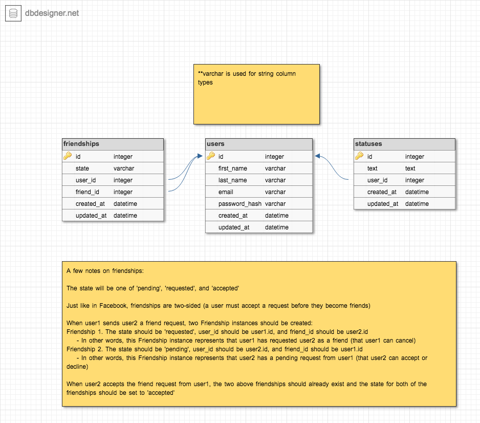

# HW3: Facebook Lite

## Task

This assignment is designed to help you build upon the basic Rails functionality you implemented in the last assignment. The main concepts the assignment will cover are Active Record Queries, Validations, and Sessions.
You will implement a subset of Facebook features including login, friending, and creating statuses. You will also be required to integrate styling and deployment as you did in the previous assignment.

You can run `rails console` (or `rails c`) to bring up an interactive console that will allow you to directly create friendships, users and statuses. However, you will also be able to run `rails server` (or `rails s`) and visit http://localhost:3000 to see your code in action! Note that you must have the server running in order to be able to visit localhost. While making changes, you will not have to restart the server every time.
To check your style, run `rubocop`. To run the test suite, run `rspec`. Be sure to run `bundle install`.

## Database Schema

You won't write any code in this section, just open up the image and take a look at the schema describing the tables you'll need. There is an explanation about the way that friendship relationships should be defined. This may be a little confusing, so please take the time to fully understand this and ask on CampusWire for clarifications.

## Migrations

You may use the Rails generator commands to generate your tables in this assignment.

1. **User:** A user should have a first_name, last_name, email, and password_hash (all of type string).
2. **Status:** A status should have a reference to the user table and a text column of type text.
3. **Friendship:** A friendship should have a reference to a `user`, a reference to a `friend`, and a state of type `string`. Since there is no friend table, there are a couple of ways to create this reference. The first is to use the references type and then open the created migration and remove , `foreign_key: true` next to friend. The second is to make a `friend_id` column of type `integer`. I recommend the first.

## Models

### User Model

You will implement four instance methods that you can use on any user instance:

#### `User#full_name`
This method should return the `first_name` and `last_name` separated by a space.

#### `User#send_friend_request(friend)`
This is an instance method that attempts to send a friend request from the instance it is being called on to the `friend` argument that it is passed.

You should immediately return if a friendship already exists either from the user that the method is being called on to `friend` or vice versa. Remember that you can access the user that an instance method is being called on with `self`.

As an example of the above, imagine we have `user1` and `user2`. If we call `user1.send_friend_request(user2)`, the method call should immediately return if `Friendship.exists?(user: user1, friend: user2)` or `Friendship.exists(user: user2, friend: user1)` returned true.

Create a `Friendship` instance from the current instance to the passed in `friend` argument with `state` `'requested'`. Create another `Friendship` instance from the passed in `friend` to the current instance with `state` `'pending'`. (Refer back to the database schema diagram if this is confusing)

#### `User#accept_friend_request(friend)`
This is an instance method that attempts to accept a friend request from `friend` to the current instance.

You can only accept a friend request if a request has actually been sent, which means that there must be a `requested` friendship from `friend` to the current instance and a `pending` friendship from the current instance to `friend`. Attempt to find both of these relationships and return unless they both exist.

Update both of the friendships that you just found with a `state` of `accepted` (make sure that this change is committed to the database).

#### `User#delete_friend(friend)`
This is an instance method that attempts to delete friendships in both directions.

Try to find a friendship from the current instance to the current user to the `friend` and destroy the relationship if it exists. Try to find a relationship in the other direction and destroy it if it exists.

#### BCrypt

You should use BCrypt to manage password encryption in your `User` model. The `bcrypt` gem has already been added to your Gemfile, so you just need to `include BCrypt` and implement the `#password` and `#password=` methods according to the <a href="https://github.com/codahale/bcrypt-ruby" target="_blank">documentation</a>.

You will have to make one small modification to the `#password` method. In this method, you should only attempt to conditionally assign `@password` if `password_hash` is not `nil`.

#### Validations
Custom validations are private instance methods you will implement, and they are referenced  with the `validate` keyword
1. A `first_name` must be present.
2. A `last_name` must be present.
3. An `email` must be present and unique.
4. Write a custom validation that adds to `errors` with the attribute `:first_name` and message `'must be capitalized'` if the `first_name` is not `nil` and not capitalized. Make sure that you check that the `first_name` is `nil` first, otherwise it will throw an error.
5. Write a custom validation that adds to `errors` with the attribute `:last_name` and message `'must be capitalized'` if the `last_name` is not `nil` and not capitalized.
6. Write a custom validation that adds to `errors` with the attribute `:email` and message `"must have an '@' and a '.'"` if the `email` is not `nil` and either does not contain an `@` or a `.`.

### Status Model

#### Validations:
1.  The text must be present and at least 5 characters in length

### Friendships Model

#### Validations:
1. `state` must be present and its value must be one of the following: `'accepted', 'pending', 'requested'`. You can check [this guide](https://guides.rubyonrails.org/active_record_validations.html#inclusion) if you are unsure on how to implement this.
1. A friend must be unique in the scope of the user.
1. Write a custom validation that adds to errors with the attribute `:user` and message 'cannot friend itself' if user equals friend. (be careful with how you compare the user instances)

### Associations
Your goal is to link the models together using ActiveRecord associations.
Be sure to set the dependent option to `:destroy` where appropriate.

#### Status
1. A `status` should belong to a `user`.

#### Friendship
1. A `friendship` should belong to a `user`.
2. A `friendship` should belong to a friend. Be sure to set the `class_name` option to `'User'`.

#### User
1. A `user` should have many `statuses`.
2. A `user` should have many `friendships`.

### Sanity Check
At this point, you should be able to run `rspec spec/models` and pass all of these tests.

## Controllers

### Application Controller

#### `logged_in?`
You should define a `helper_method` that returns the value of `:user_id` in the `session` hash.

#### `current_user`
You should define a `helper_method` that conditionally assigns (and returns) `@current_user` if there is a user logged in.

#### `authenticate_user`
This should not be a `helper_method` since we do not want to access this method in the view. It should redirect to the root path unless a user is logged in.

### Sessions Controller

You should create the `SessionsController` with the controller generator.

#### `new`
This should be a GET request to `/login`. Don't forget to define the route in `config/routes.rb`.

This action will be responsible for rendering the login form. Assign `@user` to a new `User` instance. It will be used in the login form.

#### `create`
This should be a POST request to `/login`.

This action will be responsible for logging the user in. When the user fills in the login form, they will pass in an `email` and a `password`. Attempt to find the `user` with the passed in email (it will be accessible from the `params` hash) and assign this user to a variable.

If the user that you just found is not `nil` and the user's `password` equals the password passed into the form, log the user in by assigning `:user_id` in the `session` hash to the user's `id`. Redirect to the root path.

Otherwise, redirect to the login path.

#### `destroy`
This should be a DELETE request to `/logout`.

This action will be responsible for logging the user out. Log the user out with `reset_session` and then redirect to the root path.

### Users Controller
Generate the 7 RESTful routes as usual. This would be a good place to use the Scaffold Controller generator

#### `show`
Inside of the `show` action, define an instance variable `@status` that initializes a new Status object

#### `edit`
Inside of the `edit` action, redirect to the root path unless the user is equal to `@current_user`

#### `create`
If the user is successfully saved to the database, be sure to **log them in by setting the `user_id` in the session hash**.

#### `update`
If the user is successfully updated, be sure to log them in.

#### `destroy`
After destroying a user, you should be sure to log them out.

#### `user_params`
Right now, `user_params` is expecting a `password_hash` to be submitted with the user form since the users table has a `password_hash` column. We know that the form will actually submit a password so change `user_params` to expect a password instead

#### Authentication
You should authenticate the user before all actions except `index`, `show`, `new`, and `create`. (This would be a good place to use a `before_action`)

### Additional User Actions

#### `friend_requests`
You can leave this action empty. We will implement functionality in the views that utilizes this.

#### `send_friend_request`
Inside this action, we want to utilize the `send_friend_request` method from the user model. Remember that the current_user is the one sending the request.
After sending the friend request, we want to add this line to the end of our action: `redirect_back(fallback_location: @user)`. This ensures that we are redirecting back to the show page of the user sending the request.

#### `accept_friend_request`
Inside this action, we want to utilize the `accept_friend_request` method from the user model. Remember that the current_user is the one accepting the request.

After sending the friend request, we want to add this line to the end of our action: `redirect_back(fallback_location: current_user)`

#### `delete_friend_request`
Inside this action, we want to utilize the delete_friend method from the user model. Remember that the current_user is the one deleting the friendship.

After sending the friend request, we want to add this line to the end of our action: `redirect_back(fallback_location: current_user)`

### Status Controller

This file is being provided to you almost completely intact and the routes have already been defined. You should be sure to authenticate the user before every action. After you've done this, try creating a status from the logged in user's profile.

### Welcome Controller

#### `index`
First, you will need to check whether the user is logged in, and return if they are not.

Next, we need to initialize a Status instance so that the user can post statuses from their home page/feed.

After this, we should display all our statuses on the homepage by calling on `@statuses`. Calling on `@statuses` will contain all of the statuses for the current user and their friends, but it needs to be ordered in descending order of `created_at`. You can chain a call to order onto the current implementation. Refer to the end of the assignment for a hint on how you can do this.

## Sanity Check
At this point, you should be able to create a user and be automatically logged in, log the user out, and then log back in. You should also be able to send and accept friend requests and delete existing friends.

## Views

The views are mostly implemented for you, but you will need to edit the navbar partial code.

## Styling and Deployment

You can follow the same styling and deployment instructions from the last assignment, although we highly encourage you to add as much styling to your site as you can.

To properly style your site, the minimum requirement is:

1. To wrap the page content inside a container on every page.
2. To have a navbar:
* Right now all of the links will be displayed in the navbar (regardless of whether or not the user is logged in). Update the navbar to make sure that the user's full name, Friend Requests, and Log out links are only displayed if the user is logged in. If the user is not logged in, you should display Sign up and Log in links instead.

4. Use the Bootstrap grid system to organize the content on your homepage, and/or style your /posts page.
5. Add paddings, borders, margins, or modify color, font-size, background colors as you see fit

## Advanced Active Record Queries

Let's go over some Advanced Active Record Queries that can help you with this assignment. So far, we've only used `find` which limits us to querying by `id` all the time. But what if we wanted to query by some other attribute like name or school? Then `find` doesn't really help us here.

Some common methods that we use are: `where`, `find_by`, `limit`, and `order`. This is how we use these 4 methods:

- Get all users with first name 'Grace'
  - `User.where(first_name: 'Grace')`
      - returns an array with *all* matches or an empty array if no matches
- Get the *first* match i.e. the first user with first name 'Grace' *and* last name 'Hopper'
  - `User.find_by(first_name: 'Grace', last_name: 'Hopper')`
      - returns `nil` if no matches
- Get the first two users
  - `User.limit(2)`
- Get all of the users in
  - Ascending order of last name: `User.order(last_name)`
  - Descending order: `User.order(last_name: :desc)`

`where` and `find_by` take in a hash, so you can enter as many parameters into the method as you want.

The nice thing is that you can also chain these methods in any combination like so: `User.where(first_name: 'Grace').limit(10).order(id: :desc)`. But note that sometimes the order in which the methods are chained matters. Is `User.limit(10).where(first_name: 'Grace').order(id: :desc)` different from `User.where(first_name: 'Grace').limit(10).order(id: :desc)`? We'll leave that as an exercise for you.

## Extra Credit
Here are a few extra credit ideas you can try out:

- Add additional validations for your models (Easy) 
- Add a profile picture or avatar for your user (Medium)
- Add friends list to the user's profile page (Medium)
- Enable comments and likes to user's statuses (Medium)
- Use React/Vue to Replace ERB (Hard)

Each "Easy" is worth 5% more points. Each "Easy" feature not listed here is worth 6% more points.
Each "Medium" is worth 10% more points. Each "Medium" feature not listed here is worth 12% more points.
Each "Hard" is worth 15% more points. Each "Hard" feature not listed here is worth 18% more points.

You can ask about the implementation of all extra credit features in office hours or on CampusWire public channels / public questions.

## Submission

1. Commit your changes and push your changes to Gitlab.
2. Make a zip for this folder, and upload it on Canvas.
3. In your canvas submission, make sure you put the **link** of your deployed Facebook Lite site in submission comment.
